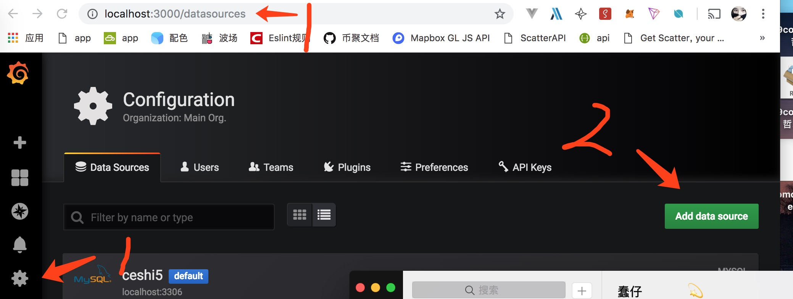
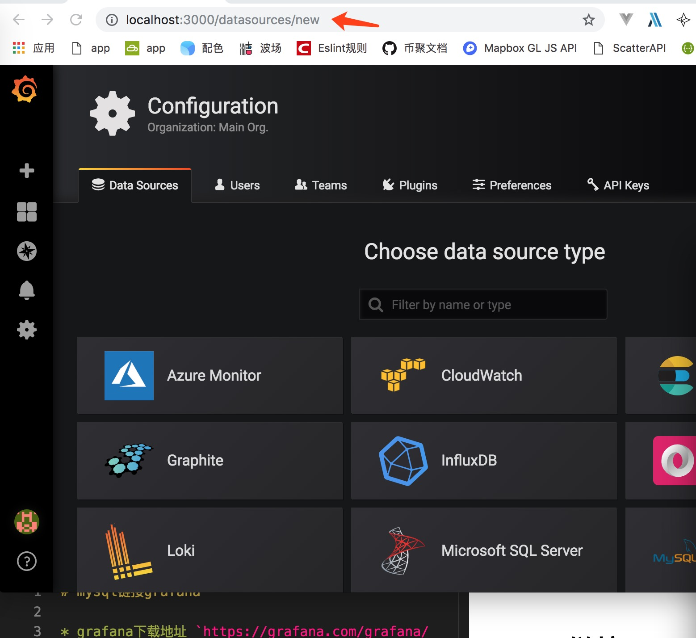
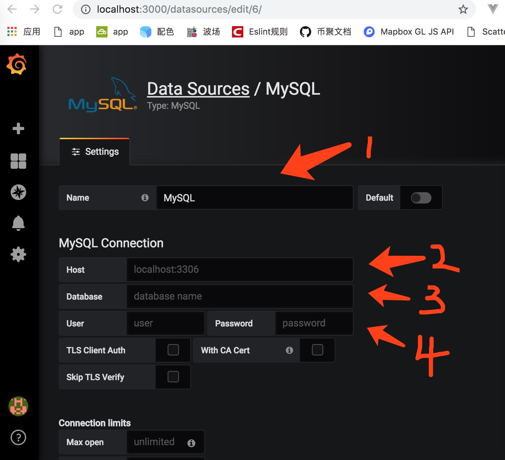
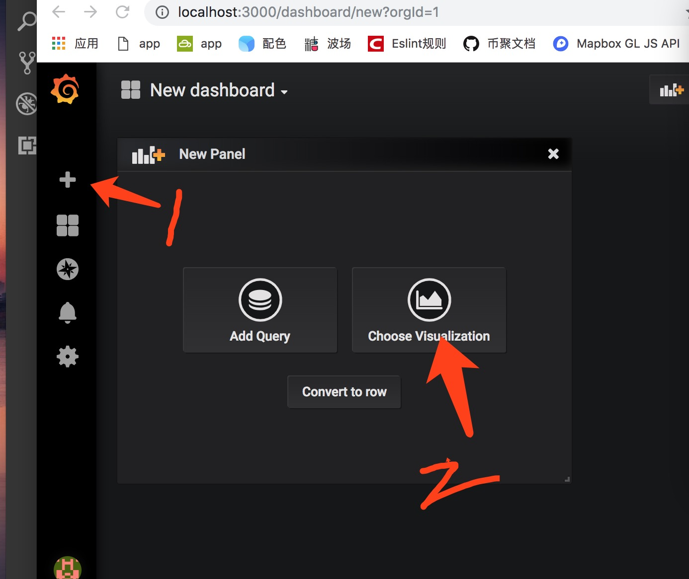
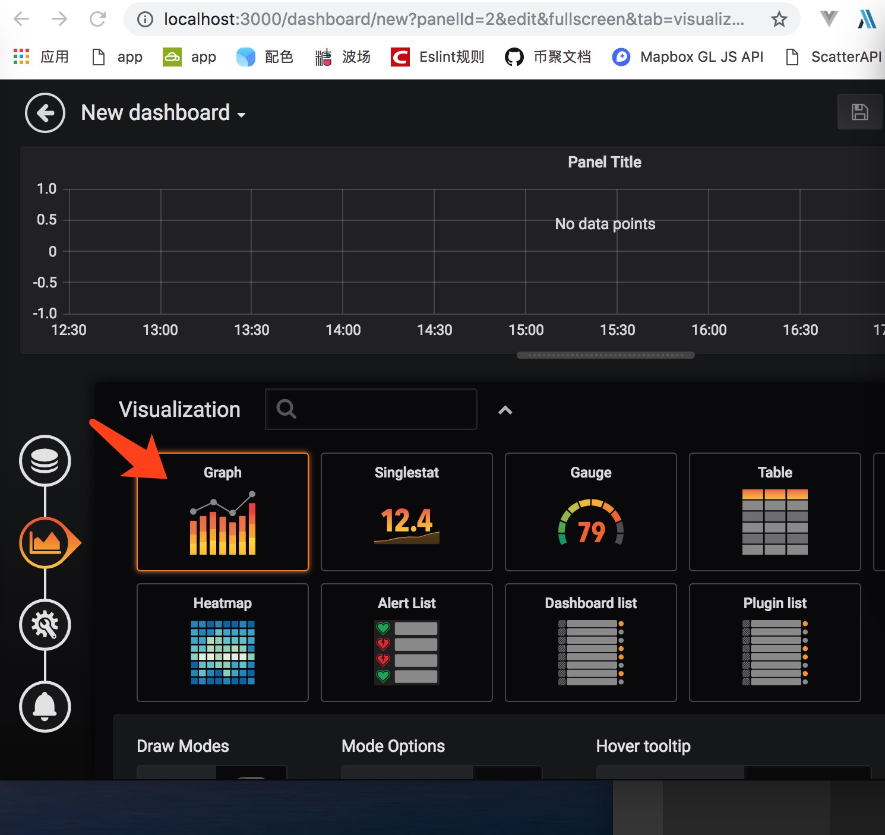
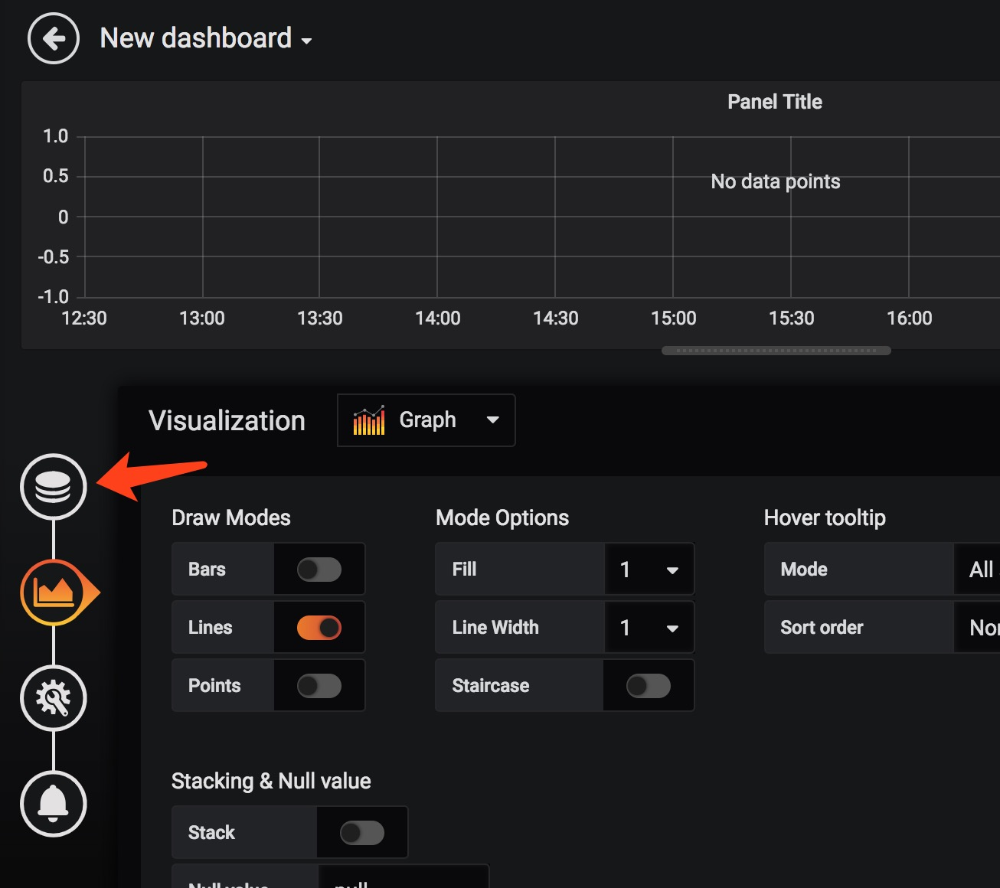
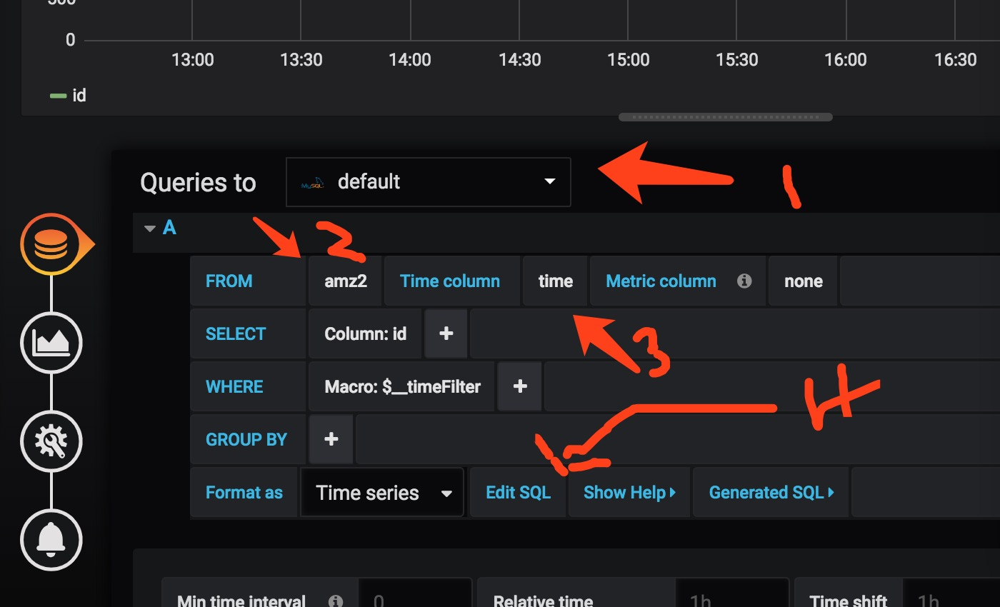

# mysql链接grafana

* grafana下载地址 `https://grafana.com/grafana/download?platform=mac`
* macOS 下载方法 `brew install grafana`
* 启动grafana `brew services start grafana`
* 停止grafana `brew services stop grafana`
* grafana默认端口为3000 浏览器访问`http://localhost:3000`
* grafana默认账号为`admin`,默认密码为`admin`

### 登陆账号后 可以通过浏览器地址栏地址进入次页面,也可以点击1箭头表示后在点击`Data Sources`进入此页面。
### 点击2剪头,进入下面图

### 找到`mysql`并点击,进入下面页面

* 1`声明此数据源名称`
* 2`mysql数据库地址`
* 3`mysql数据库名称`
* 4`数据库账号和密码`
### 填写完后点击下面保存 后继续按照下图进行

* 点击+号后 点击`create`会进入上图页面。
* 点击2剪头进入下一个页面。

### 双击剪头所指

* 1`选择你刚才添加的mysql数据源`
* 2`选择数据库里面的表`
* 3`选择表里面时间`
* 4`编写mysql语句`
